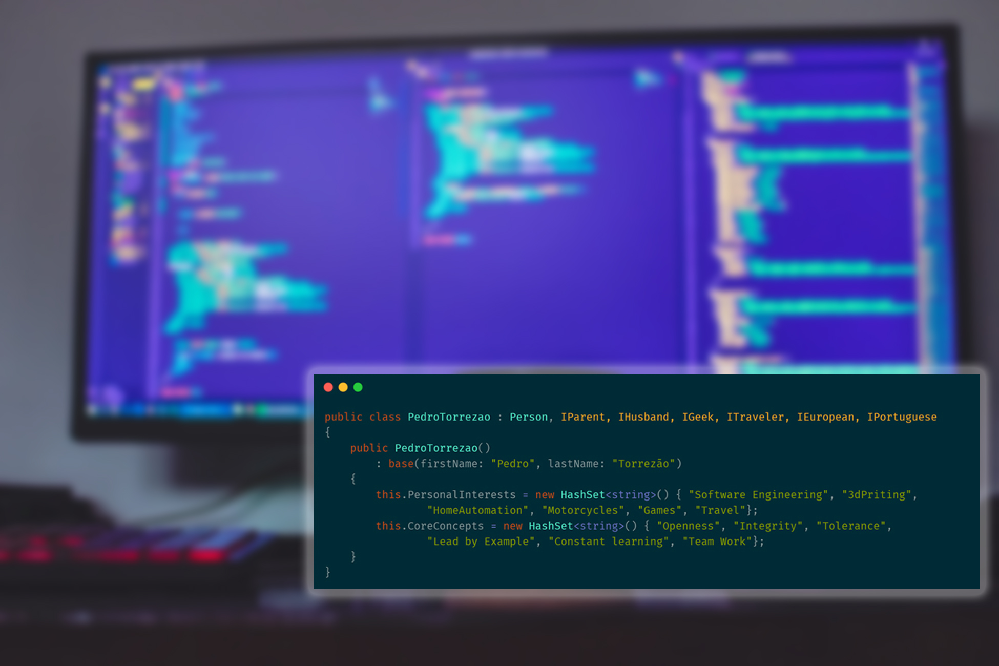
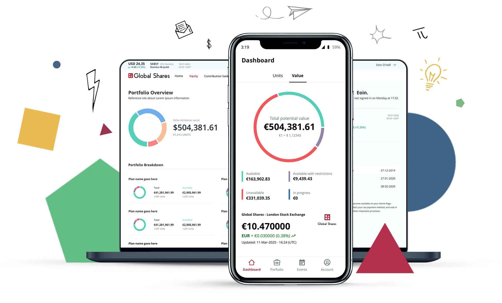
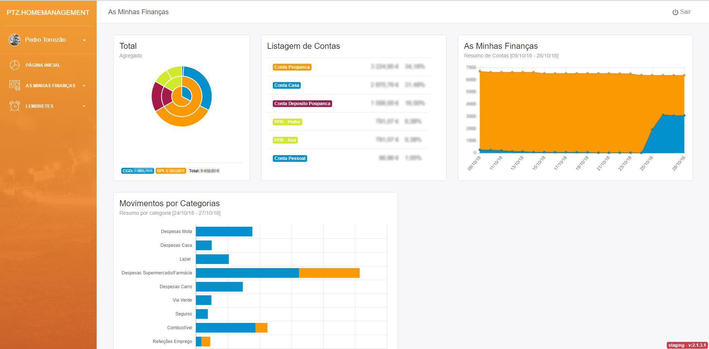
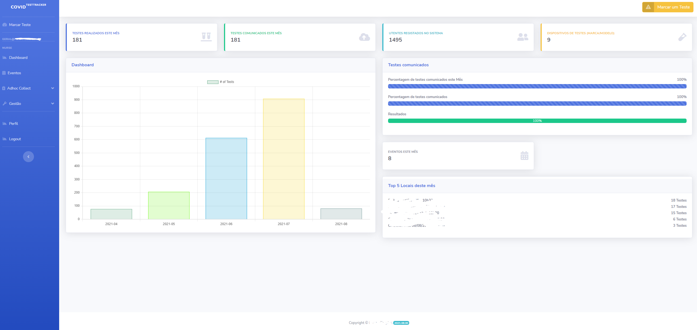
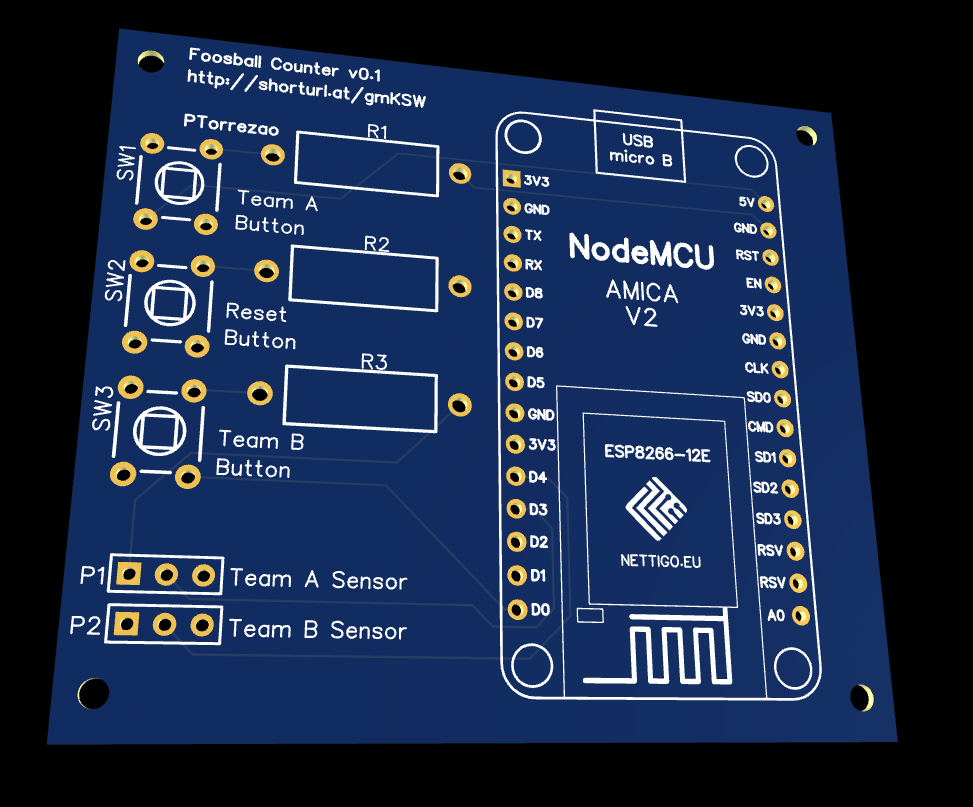

<style scoped>
h1 {
  color: white;
}
p{
 padding-left:80%;
 margin-top:-16px;
}

h1,h2 {
  overflow: hidden; /* Ensures the content is not revealed until the animation */
  border-right: .15em solid transparent; /* The typwriter cursor */
  white-space: nowrap; /* Keeps the content on a single line */
  letter-spacing: .010em; /* Adjust as needed */
}

h1 {
  animation:
    typing 3.5s steps(40, end),
    blink-caret .75s step-end infinite;
}
h2 {
  opacity: 0;
  animation:
    typing_h2 3.5s steps(40, end),
    blink-caret .75s step-end infinite;
  animation-delay: 1900ms;
  animation-fill-mode: forwards;
}

@keyframes typing {
  from { width: 0;  }
  to { width: 100%; }
  1% {  border-right: .15em solid white;   }
  90% {  border-right: .15em solid white;   }
}
@keyframes typing_h2 {
  from { width: 0; opacity: 1; border-right: .15em solid white; }
  to { width: 100%; opacity: 1; }
  1% {  border-right: .15em solid white;   }
  99% {  border-right: .15em solid white;   }
}

@keyframes blink-caret {
  from, to { border-color: white }
  50% { border-color: white; }
}

</style>


# Hi, I'm Pedro Torrezão
## Sr. Software Engineer [@Global Shares](https://www.globalshares.com) 
[](https://github.com/ptorrezao) [](https://www.linkedin.com/in/pedrotorrezao/) [](https://ptorrezao.smugmug.com/) [](https://www.facebook.com/ptorrezao/) [](mailto:pedro.torrezao@gmail.com)


---

#### Quem sou:

```
Pai; Developer (+10 anos); Team Leader; Scrum Practitioner 
Engineer; Maker; 
```

#### Hobbies/Gostos
```
Programação; Impressão 3d; Home Automation; 
Tecnologia; Motas; Eletrónica; Viagens; Gaming;
```
---


# Percurso Académico


## Escola Profissional Salvaterra de Magos 
(2004-2007)
Euro-Escola; Prova de Aptidão Profissional; Estágio Curricular
## Escola Superior de Gestão e Tecnologia 
(2009-2012)
<!-- EPSM deu me bagagem tecnica para trabalhar logo na area, e o superior foi solidificar conhecimentos -->

---
# Percurso Profissional
### Estágio (via EPSM) + [CIBEN](https://www.ciben.pt/) 
- Apliquem-se no estágio, podem reparar em vocês! 
### [Link Consulting](https://www.linkconsulting.com/)
- "A ida para Lisboa"
### [Unisys](https://www.unisys.com/)/[Olisipo](https://www.olisipo.pt/)
- "Impostor syndrome", a dúvida nas vossas capacidades é normal!
<!-- O Estágio pode parecer apenas como algo teem que concluir para acabarem o curso, mas cuidado que o estágio pode abri-vos portas, e mim potenciou que trabalha-se e estudasse ao mesmo tempo, com a vantagem de trabalhar na area.
Ir para o mercado de trabalho para Lisboa, foi como "ir para a piscina dos grandes" 
-->

---

# [](https://www.globalshares.com/)
- Experiência Internacional
- 3 Meses na Sede da Empresa
- Talento Multi-Cultural (+500 pessoas)
- 15 Escritórios
    Lisboa; Cork; Barcelona; Clonakilty são TechHub
- Gestão de Equipas Remotas (PT;ES;IE)


<!-- Sair de Portugal foi sem duvida um dos pontos, mais enriquecedores de todo o percurso.
Conhecer novas culturas, não só a irlandesa mas de todas as envolvidas, Indiana, Vietnamita, Espanhola, etc.

Desafio adicional de gerir pessoas em diferentes fusos horario-->

---
# [](https://www.globalshares.com/)
- Programação do Produto
- Reuniões de Planeamento
- Acompanhamento da Equipa
- Reuniões Técnicas com Clientes/Partners

<!-- Bastante trabalho, entre planear o produto trabalho como executar e manter a equipa motivada.-->


---
# Desafios ao Longo do Percurso
- Trabalhar e Estudar
- Insegurança Pessoal
- Medo de não corresponder a expectativa
<!-- Os vossos desafios/medos são novos apenas para voces! Já houve que passa-se por isso! -->
# Os novos desafios
- Mentoring/Passagem de Conhecimento Remoto
- Gestão da Equipa em tempos de Pandemia
- Remote Work + Kids@Home


---

# Conselhos
- Tenham um plano, mas estejam preparados para adapta-lo mas não desistir dele. 
- Honestidade, Humildade e Hardwork
- Ponham-se no lugar do outro, percebam o outro lado.
- E Divirtam-se a trabalhar (Nerfs allowed :smile:)

Tomem estes conselhos com um pouco de sal!

<!-- Devem saber o que querem para o vosso futuro, ou pelo menos o que não querem. 
Muito trabalho, existem muitos dias de chuva antes um dia de sol.
No trabalho, tentem remar todos para o mesmo lado, se o foco está em tramar o outro, a que realmente interessa passa ao lado.-->
---

# Melhorar sempre
- Mais e melhores Ferramentas/Técnicas para as vossas tarefas.
- Melhorar a rede contactos
- Procurar obter certificações reconhecidas

[](https://www.scrum.org/courses/professional-scrum-master-training) [](https://www.scrum.org/courses/professional-scrum-master-ii-training) [](https://www.scrum.org/courses/scaled-professional-scrum-nexus-training)[](https://www.cncf.io/certification/ckad/) [](https://docs.microsoft.com/pt-pt/learn/certifications/azure-developer/)

---
# Code/Projects
Por razões legais, não posso partilhar informações sobre o projecto em que estou envolvido mas ficam alguns projectos próprios e ficam alguns printscreens (públicos).

---
[](https://play.google.com/store/apps/details?id=com.globalshares.mobile&hl=pt_PT&gl=US)

---
# [PTZ.HomeManagement](https://github.com/ptorrezao/PTZ.HomeManagement)
> This is a asp.net webapp application powered by ASP.NET Core and Docker and main function is manage the household items (Warranties, etc). (This started as Pet Project to learn ASP.NET Core and Docker, so keep that in mind)

---
[](https://github.com/ptorrezao/PTZ.HomeManagement)


---
# Covid Test Tracker

[](https://www.scrum.org/courses/professional-scrum-master-training)

---

[](https://www.scrum.org/courses/professional-scrum-master-training)

---
# [Opsgenie nodes Node-RED](https://github.com/edreanernst/node-red-contrib-opsgenie)

> Opsgenie nodes Node-RED
> Platform License Downloads NPM Known Vulnerabilities
> 
> These node-red nodes are used to work with Opsgenie using the REST API.

---

# [Foosball Counter](https://github.com/ptorrezao/FoosballCounter)

> This is a simple ESP8266 project with the intent of act as a Scoreboard for a Foosball Table

[](https://github.com/ptorrezao/FoosballCounter)

---

# <!--fit--> Questões??

## Obrigado!

[](https://github.com/ptorrezao) [](https://www.linkedin.com/in/pedrotorrezao/) [](https://ptorrezao.smugmug.com/) [](https://www.facebook.com/ptorrezao/) [](mailto:pedro.torrezao@gmail.com)

