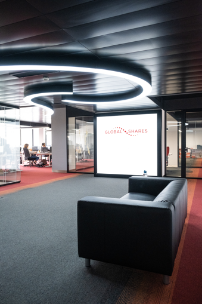
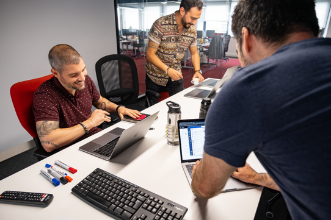

# Hi, I'm Pedro Torrezão
## Sr. Software Engineer at [Global Shares](https://www.globalshares.com) 
[](https://github.com/ptorrezao) [](https://www.linkedin.com/in/pedrotorrezao/) [](https://ptorrezao.smugmug.com/) [](https://www.facebook.com/ptorrezao/) [](mailto:pedro.torrezao@gmail.com)


---


#### Quem sou:
```
Pai; Developer (+10 anos); Team Leader; 
Engineer; Maker; 
```

#### Hobbies/Gostos
```
Programação; Impressão 3d; Home Automation; 
Tecnologia; Motas; Eletrónica; Viagens; Gaming;
```

---

# Percurso Académico


## Escola Profissional Salvaterra de Magos 
(2004-2007)
Euro-Escola; Prova de Aptidão Profissional; Estágio Curricular
## Escola Superior de Gestão e Tecnologia 
(2009-2012)
<!-- EPSM deu me bagagem tecnica para trabalhar logo na area, e o superior foi solidificar conhecimentos -->

---
# Percurso Profissional
### Estágio (via EPSM) + [CIBEN](https://www.ciben.pt/) 
- Apliquem-se no estágio, podem reparar em vocês! 
### [Link Consulting](https://www.linkconsulting.com/)
- "A ida para Lisboa"
### [Unisys](https://www.unisys.com/)/[Olisipo](https://www.olisipo.pt/)
- "Impostor syndrome", a dúvida nas vossas capacidades é normal!
<!-- O Estágio pode parecer apenas como algo teem que concluir para acabarem o curso, mas cuidado que o estágio pode abri-vos portas, e mim potenciou que trabalha-se e estudasse ao mesmo tempo, com a vantagem de trabalhar na area.
Ir para o mercado de trabalho para Lisboa, foi como "ir para a piscina dos grandes" 
-->

---

# [](https://www.globalshares.com/)
- Experiência Internacional
- 3 Meses na Sede da Empresa
- Talento Multi-Cultural (+300 pessoas)
- 15 Escritórios
    Lisboa; Cork; Barcelona; Clonakilty são TechHub
- Gestão de Equipas Remotas (PT;ES;IE)


<!-- Sair de Portugal foi sem duvida um dos pontos, mais enriquecedores de todo o percurso.
Conhecer novas culturas, não só a irlandesa mas de todas as envolvidas, Indiana, Vietnamita, Espanhola, etc.

Desafio adicional de gerir pessoas em diferentes fusos horario-->

---
# [](https://www.globalshares.com/)
- Programação do Produto
- Reuniões de Planeamento
- Acompanhamento da Equipa
- Reuniões Técnicas com Clientes/Partners

<!-- Bastante trabalho, entre planear o produto trabalho como executar e manter a equipa motivada.-->




---
# Desafios ao Longo do Percurso
- Trabalhar e Estudar
- Insegurança Pessoal
- Medo de não corresponder a expectativa
<!-- Os vossos desafios/medos são novos apenas para voces! Já houve que passa-se por isso! -->
# Os novos desafios
- Mentoring/Passagem de Conhecimento Remoto
- Gestão da Equipa em tempos de Pandemia
- Remote Work + Kids@Home

---
# Conselhos
- Tenham um plano, mas estejam preparados para adapta-lo mas não desistir dele. 
- Honestidade, Humildade e Hardwork
- Ponham-se no lugar do outro, percebam o outro lado.
- E Divirtam-se a trabalhar (Nerfs allowed :smile:)

Tomem estes conselhos com um pouco de sal!

<!-- Devem saber o que querem para o vosso futuro, ou pelo menos o que não querem. 
Muito trabalho, existem muitos dias de chuva antes um dia de sol.
No trabalho, tentem remar todos para o mesmo lado, se o foco está em tramar o outro, a que realmente interessa passa ao lado.-->

---

# <!--fit--> Questões??

## Obrigado!

[](https://github.com/ptorrezao) [](https://www.linkedin.com/in/pedrotorrezao/) [](https://ptorrezao.smugmug.com/) [](https://www.facebook.com/ptorrezao/) [](mailto:pedro.torrezao@gmail.com)
